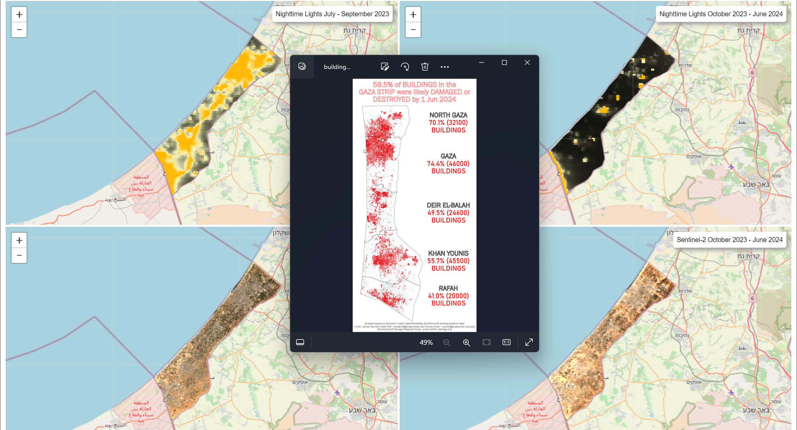

# Visualization of the impacts of the continual attacks by the IDF in the Gaza Strip using nighttime lights and multi-temporal Sentinel-2 images

## Visualization Results

### Nighttime Lights and Sentinel-2 Images before and after the Event
<video width="600" controls>
  <source src="Images/Linked_Maps.mp4" type="video/mp4">
</video>

### Nighttime Lights and Sentinel-2 Images before and after the Event with building footprints damage from Jamon & Corey
 

## Data Sources & References
Earth Observation Group, Payne Institute for Public Policy, Colorado School of Mines. https://eogdata.mines.edu/products/vnl/#monthly

European Union/ESA/Copernicus: https://developers.google.com/earth-engine/datasets/catalog/COPERNICUS_S2_SR_HARMONIZED

Jamon Van Den Hoek & Corey Scher. Decentralized Damage Mapping Group. www.conflict-damage.org. Accessed 05 June 2024

Qiusheng Wu. geemap. https://github.com/gee-community/geemap/blob/master/examples/notebooks/70_linked_maps.ipynb